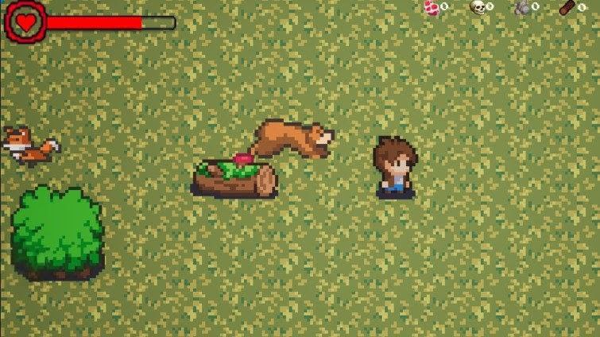
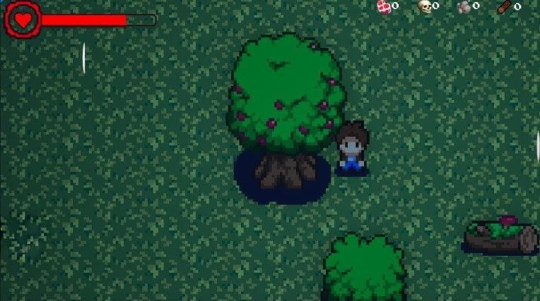
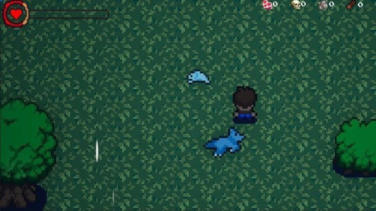

    

## Project Description:

Call of the Forest is a 2D survival game that allows for multiplayer mode for two players. Movement is controlled using the WASD keys, and the mouse is used for attacking. The main goal is to survive for as many days as possible, but the gameplay is made more challenging by the hostile creatures.

## Screenshots:

    
    
    

## Controls:

| Buttons | Action | 
| --- | --- | 
| `W` | Move forward | 
| `A` | Move left | 
| `S` | Move backward |
| `D` | Move right |
| `Q` | Eat |
| `E` / `LMC` | Attack |
| `U` | Upgrade sword | |

## How to install:
The game was created only for the Linux platform

# Linux
